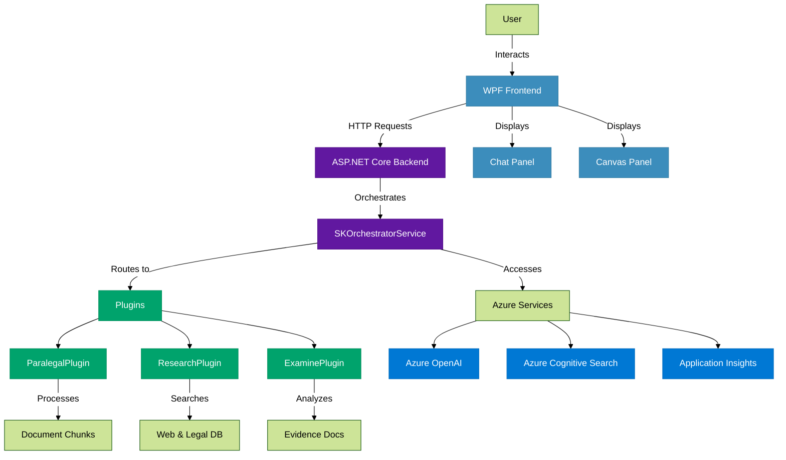
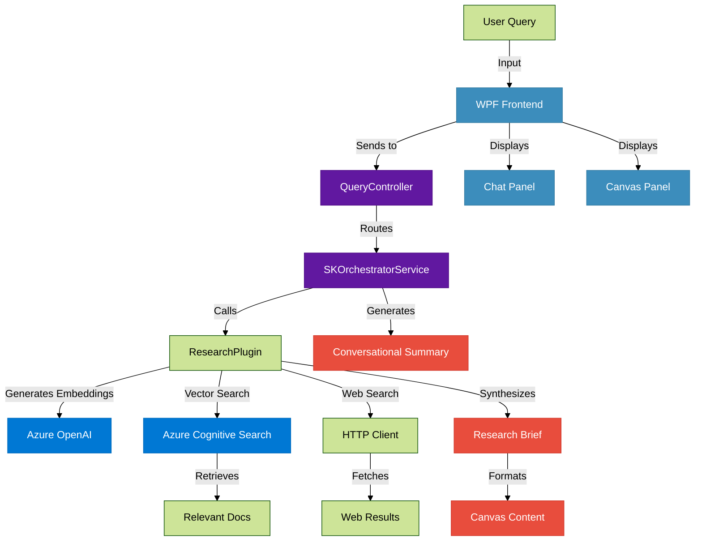
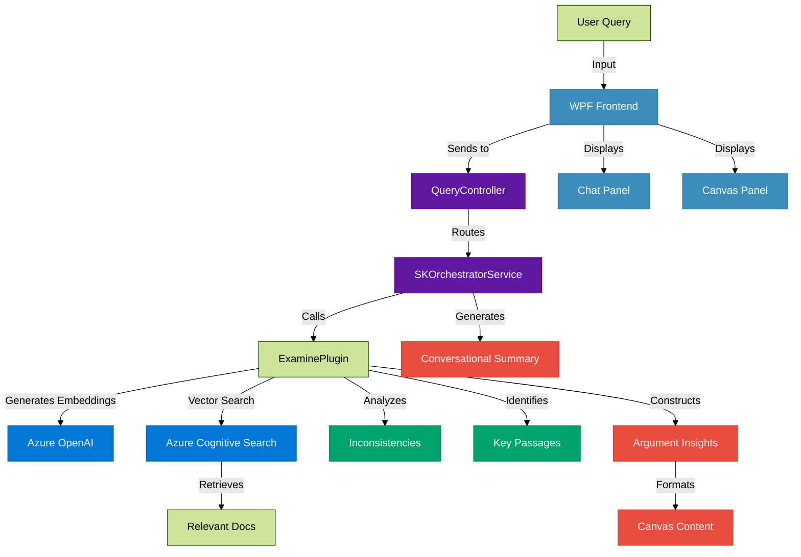
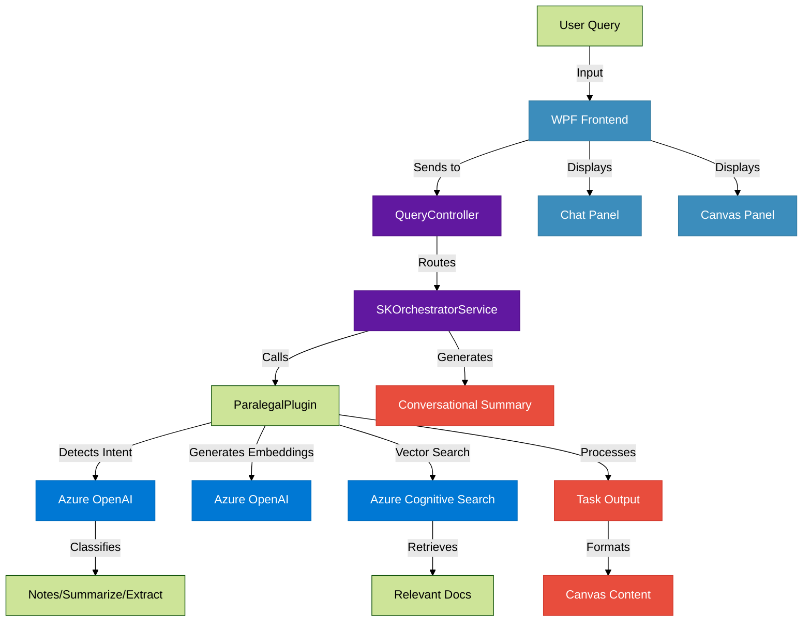

# <div align="center"> **Counsel**</div>

<div align="center">

## AI-Powered Legal Assistant for the Modern Attorney

[](https://azure.microsoft.com)
[](https://docs.microsoft.com/en-us/dotnet/csharp/)
[](https://github.com/microsoft/semantic-kernel)
[](https://github.com/dotnet/wpf)
[](https://github.com/your-repo/counsel)

**Microsoft AI Agents Hackathon 2025 Entry**
</div>

---

<div align="center">
  
  <p><em>Transform your legal practice with intelligent document analysis, deep research, and AI-powered assistance</em></p>
</div>

## 🚀 Project Overview

**Counsel** is a sophisticated AI assistant designed specifically for legal professionals. By leveraging the power of Azure OpenAI and Semantic Kernel, Counsel transforms the way attorneys interact with legal documents, conduct research, and prepare for cases. With intuitive modes for document analysis, cross-examination preparation, and paralegal assistance, Counsel becomes an indispensable tool in your legal arsenal.

## ✨ Key Features

| Feature | Description |
|---------|-------------|
| 🔄 **Mode-Based Interaction** | Seamlessly switch between Chat, Deep Research, Paralegal, and Cross-Examine modes for tailored legal workflows |
| 📝 **Intelligent Document Processing** | Analyze, summarize, and extract key entities (e.g., dates, amounts) from legal documents |
| 🔍 **RAG-Enhanced Responses** | Leverage Retrieval-Augmented Generation with Azure Cognitive Search for contextually relevant answers |
| 📅 **Natural Language Calendar Generation** | Create .ics calendar files from natural language event descriptions |
| 💻 **Interactive WPF UI** | Features animated sidebars, dynamic message bubbles, and a canvas for detailed outputs |
| 🧩 **Modular Plugin System** | Extensible plugins for research, examination, and paralegal tasks |
| 🧠 **Context-Aware Conversations** | Maintains session history for coherent, relevant responses |
| 🖥️ **Dual-Pane Layout** | Separates conversational chat from detailed canvas content for clarity |

## 🏗️ Architecture

### System Architecture

Counsel's architecture is a robust integration of frontend, backend, and Azure services, orchestrated by Semantic Kernel for intelligent task routing.



### DeepResearch Mode Workflow

DeepResearch mode combines RAG with web search to deliver comprehensive legal research briefs.



- **RAG Process:** The ResearchPlugin generates embeddings for the query using Azure OpenAI, performs vector search via Azure Cognitive Search to retrieve relevant documents, and integrates them into the response.
- **Web Search:** The plugin uses an HTTP client to fetch external legal resources, enhancing the research with up-to-date information.
- **Output:** A structured research brief is displayed in the canvas, with a conversational summary in the chat panel.

### CrossExamine Mode Workflow

CrossExamine mode builds legal arguments by analyzing documents for inconsistencies and key passages.



- **Argument Building:** The ExaminePlugin identifies contradictions and relevant passages in documents, constructing structured insights for cross-examination.
- **RAG Integration:** Uses vector search to retrieve pertinent document chunks, ensuring contextually accurate analysis.
- **Output:** Detailed argument insights appear in the canvas, with a concise summary in the chat panel.

### Paralegal Mode Workflow

Paralegal mode dynamically selects tasks (notes, summarize, extract) based on query intent.



- **Intent Detection:** Uses Azure OpenAI to classify the query as requesting notes, summarization, or entity extraction.
- **RAG Process:** Retrieves relevant document chunks via vector search for task execution.
- **Output:** Structured task results (e.g., extracted entities) are shown in the canvas, with a summary in the chat panel.

## 📁 Project Structure

```
Counsel/
├── Counsel.BackendApi/                # ASP.NET Core Backend
│   ├── Program.cs                     # Entry point and DI configuration
│   ├── Controllers/                   # API endpoints
│   │   └── QueryController.cs         # Main API controller
│   ├── Models/                        # Data models
│   │   ├── QueryRequest.cs            # Request structure
│   │   └── QueryResponse.cs           # Response structure
│   ├── Plugins/                       # Domain-specific plugins
│   │   ├── ParalegalPlugin.cs         # Document note generation and analysis
│   │   ├── ResearchPlugin.cs          # Legal research capabilities
│   │   └── ExaminePlugin.cs           # Document examination and analysis
│   ├── Services/                      # Core services
│   │   ├── SKOrchestratorService.cs   # Central orchestration service
│   │   ├── DocumentProcessingService.cs # Document handling
│   │   ├── DateResolutionService.cs   # Date analysis and formatting
│   │   └── CalendarService.cs         # Calendar generation
│   └── Utils/                         # Helper utilities
│       └── SearchIndexHelper.cs       # Azure Search index management
├── Counsel.WpfClient/                 # WPF Frontend Application
│   ├── App.xaml                       # Application definition
│   ├── MainWindow.xaml                # UI layout definition
│   ├── MainWindow.xaml.cs             # UI logic implementation
│   ├── Models/                        # Client-side models
│   │   └── CounselModels.cs           # Shared models with backend
│   ├── Services/                      # Client services
│   │   └── ApiService.cs              # Backend communication
│   └── Resources/                     # UI resources
│       ├── Styles.xaml                # Application styling
│       └── Icons/                     # UI icons
└── Counsel.Tests/                     # Test projects
    ├── BackendTests/                  # Backend unit tests
    └── IntegrationTests/              # End-to-end tests
```

## 🧠 Core Components

### Semantic Kernel Integration

Counsel uses Semantic Kernel as the backbone for AI orchestration:

- **Kernel Setup:** Configured in Program.cs with Azure OpenAI for chat completions and embeddings.
- **Chat Completion:** Powers conversational responses with context-aware legal expertise.
- **Text Embeddings:** Generates vectors for semantic search in document retrieval.
- **Prompt Templates:** Custom prompts for intent detection, summarization, and task execution.

### Plugin System

The modular plugin system encapsulates domain-specific logic:

#### ParalegalPlugin

- **Functionality:** Generates notes, summarizes documents, and extracts entities (e.g., dates, amounts).
- **Key Methods:**
  ```csharp
  public async Task<string> GenerateDocNotesAsync(string[] documentChunks, string query)
  public async Task<string> SummarizeContextAsync(string[] documentChunks, string query)
  public async Task<string> ExtractKeyInfoAsync(string[] documentChunks, string query)
  ```

#### ResearchPlugin

- **Functionality:** Conducts legal research using RAG and web search.
- **Key Method:**
  ```csharp
  public async Task<string> PerformLegalResearchAsync(string query)
  ```
- **Details:** Combines Azure Cognitive Search for document retrieval with HTTP-based web searches for external legal resources.

#### ExaminePlugin

- **Functionality:** Builds arguments by identifying inconsistencies and key passages.
- **Key Method:**
  ```csharp
  public async Task<string> FindRelevantPassagesAsync(string query)
  ```
- **Details:** Uses RAG to retrieve documents and analyzes them for contradictions to support cross-examination.

### Orchestration Service

The SKOrchestratorService coordinates plugins and modes:

- **Query Routing:** Directs queries to the appropriate plugin based on mode.
- **Session Management:** Maintains chat history (up to 10 messages) for context.
- **Fallbacks:** Falls back to enhanced chat if specialized processing fails.
- **Key Methods:**
  ```csharp
  public async Task<QueryResponse> ProcessQueryAsync(QueryRequest request)
  private async Task<QueryResponse> ExecuteResearchModeAsync(QueryRequest request)
  private async Task<QueryResponse> ExecuteParalegalModeAsync(QueryRequest request)
  private async Task<QueryResponse> ExecuteExamineModeAsync(QueryRequest request)
  ```

### Azure Services Integration

- **Azure OpenAI:** Drives chat completions and embedding generation.
- **Azure Cognitive Search:** Enables vector-based document retrieval for RAG.
- **Azure Application Insights:** Monitors performance and logs errors.

### Natural Language Calendar Generation

- **Process:** Parses natural language (e.g., "Schedule a meeting next Tuesday at 10 AM") using DateResolutionService, generates .ics files via Ical.Net.
- **Output:** Downloadable calendar events for seamless scheduling.

## 🔄 Operating Modes

<div align="center">
<table>
  <tr>
    <th style="background-color: #3C8DBC; color: white; padding: 10px;">Mode</th>
    <th style="background-color: #3C8DBC; color: white; padding: 10px;">Description</th>
    <th style="background-color: #3C8DBC; color: white; padding: 10px;">Key Features</th>
  </tr>
  <tr>
    <td><b>💬 Chat Only</b></td>
    <td>General-purpose legal assistant with context-aware responses</td>
    <td>• Uses session history for coherent conversations<br>• Fallback for all other modes</td>
  </tr>
  <tr>
    <td><b>🔍 Deep Research</b></td>
    <td>Conducts in-depth legal research using RAG and web search</td>
    <td>• Structured research briefs with citations<br>• Combines internal and external resources</td>
  </tr>
  <tr>
    <td><b>📋 Paralegal</b></td>
    <td>Dynamically selects tasks based on detected intent</td>
    <td>• Notes generation<br>• Document summarization<br>• Entity extraction</td>
  </tr>
  <tr>
    <td><b>⚖️ Cross-Examine</b></td>
    <td>Builds legal arguments by analyzing documents</td>
    <td>• Inconsistency detection<br>• Key passage identification<br>• Argument construction</td>
  </tr>
</table>
</div>

## 🔧 Installation & Setup

### Prerequisites

- C# 8.0 SDK
- Visual Studio 2022 or later
- Azure subscription (OpenAI, Cognitive Search)

### Configuration

1. Clone the repository:
   ```bash
   git clone https://github.com/your-repo/counsel.git
   ```

2. Update appsettings.json with Azure credentials:
   ```json
   {
     "AzureOpenAI": {
       "Endpoint": "your-openai-endpoint",
       "ApiKey": "your-openai-key",
       "DeploymentName": "your-deployment-name"
     },
     "AzureSearch": {
       "Endpoint": "your-search-endpoint",
       "ApiKey": "your-search-key",
       "IndexName": "legal-documents"
     }
   }
   ```

3. Build and run:
   ```bash
   dotnet build
   dotnet run --project Counsel.BackendApi
   ```

4. Launch the WPF client:
   ```bash
   dotnet run --project Counsel.WpfClient
   ```

## 🚀 Usage Examples

### Legal Research

1. Select Deep Research mode
2. Query: "Key precedents for fair use in copyright law"
3. Review the research brief in the canvas and conversational summary in the chat

### Document Analysis

1. Upload contracts in Paralegal mode
2. Query: "Extract all dates and monetary amounts"
3. View extracted entities in the canvas

### Calendar Event

1. Query: "Schedule a deposition next Tuesday at 10 AM"
2. Click the calendar icon to download the .ics file

## 💻 Technologies Used

<div align="center">
<table>
  <tr>
    <th style="background-color: #6118A0; color: white; padding: 10px;">Category</th>
    <th style="background-color: #6118A0; color: white; padding: 10px;">Technologies</th>
  </tr>
  <tr>
    <td><b>Backend</b></td>
    <td>ASP.NET Core (C# 8) • Semantic Kernel • Azure OpenAI • Azure Cognitive Search • Ical.Net</td>
  </tr>
  <tr>
    <td><b>Frontend</b></td>
    <td>WPF (XAML) • Custom animations • Material Design influences</td>
  </tr>
  <tr>
    <td><b>Tools</b></td>
    <td>Visual Studio 2022 • Azure Developer CLI • .NET Test Framework</td>
  </tr>
</table>
</div>

## 🔮 Future Enhancements

| Enhancement | Description |
|-------------|-------------|
| 🖥️ **Multi-Platform** | Web and mobile interfaces for access from any device |
| 📄 **Document Generation** | AI-driven legal document templates and assembly |
| ⏱️ **Timeline Visualization** | Interactive case timelines with event linking |
| 👥 **Collaboration** | Real-time sharing and co-editing for legal teams |
| 🔄 **Integrations** | Connect with legal practice management systems |

## 🤝 Contributing

1. Fork the repository
2. Create a feature branch: `git checkout -b feature/your-feature`
3. Commit changes: `git commit -m 'Add your feature'`
4. Push: `git push origin feature/your-feature`
5. Open a Pull Request

## 📄 License

MIT License - see the LICENSE file for details.

---

<div align="center">
  
  <br>
  <em>Built with 🍵 for the Microsoft AI Agents Hackathon 2025</em>
</div>
